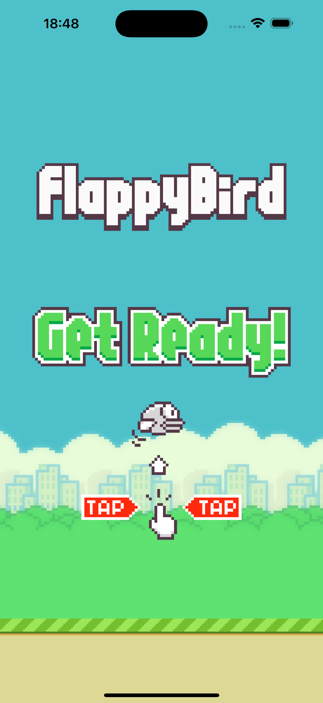
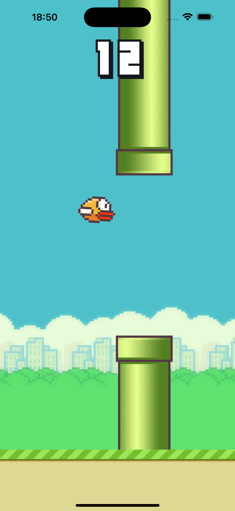

# Flappy Bird Clone con React Native, Skia y Reanimated

Este proyecto es una recreación del popular juego **Flappy Bird** utilizando **React Native**, **React Native Skia** y **React Native Reanimated**.

  
   

## Características

- **Movimiento del pájaro**: Implementación de la física del juego con gravedad y velocidad, permitiendo que el pájaro se mueva de manera realista.
- **Control táctil**: El usuario puede tocar la pantalla para hacer que el pájaro aletee y gane altura.
- **Generación de obstáculos**: Tubos superiores e inferiores que se desplazan horizontalmente y generan desafíos para el jugador.
- **Detección de colisiones**: Sistema para detectar colisiones entre el pájaro y los tubos, así como con el suelo y el techo.
- **Sistema de puntuación**: Conteo de puntos basado en la cantidad de obstáculos superados.

## Tecnologías Utilizadas

- **React Native**: Framework para construir aplicaciones móviles nativas utilizando React.
- **React Native Skia**: Biblioteca para renderizar gráficos 2D de alta calidad en React Native.
- **React Native Reanimated**: Biblioteca para manejar animaciones y gestos de manera eficiente en React Native.

## TODOs

- Randomizar el offset
- Mover la base también
- Mejorar lógica de colisiones
- Añadir animación al pájaro
- Añadir audios (música y efectos)
- Refactor code
